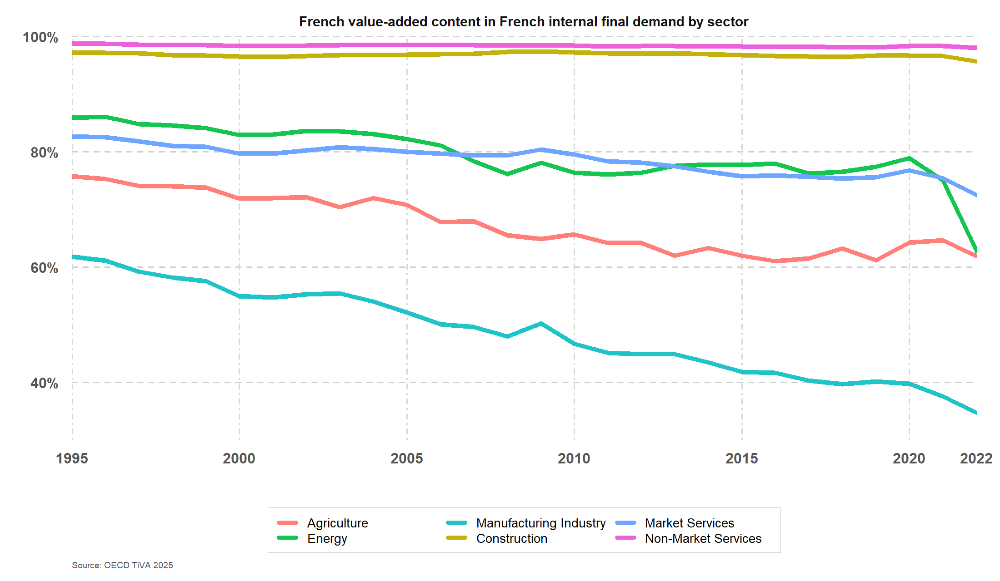
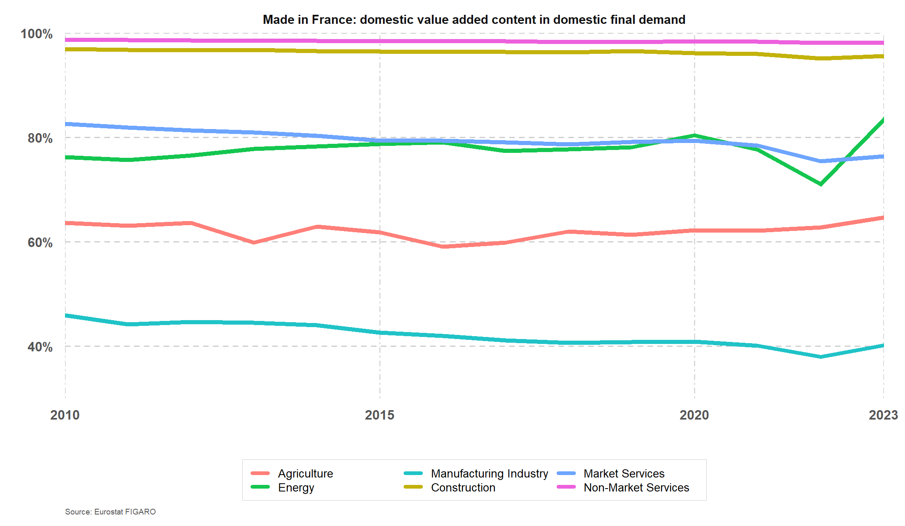
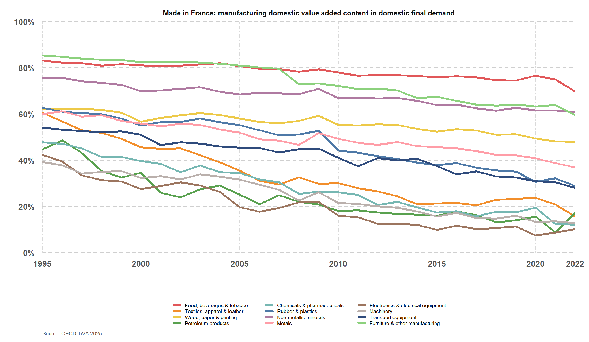
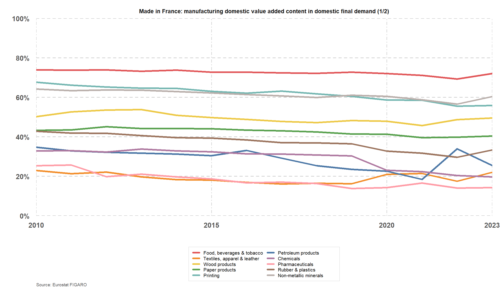
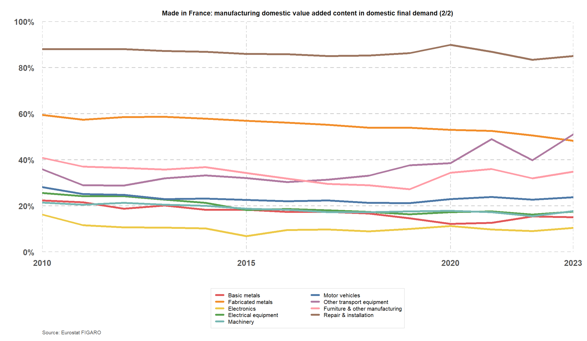

# madeIn

Reproducible R project calculating the French value-added content of French internal final demand by broad sector, using OECD TiVA.

The script downloads OECD TiVA 2025 data from the SDMX endpoint and computes, for each sector:

```text
French VA content = FD_VA(FRA, sector, FRA) / FD_VA(FRA, sector, W)
```

where:

- `FD_VA` is value added embodied in final demand.
- `FRA` as final demand country is French internal final demand.
- `FRA` as counterpart/source country is French value added.
- `W` as counterpart/source country is all value-added origins.

The values of `FD_VA` are in USD million in TiVA. The chart reports the French share in percent and the CSV also keeps the levels.



FIGARO replication:



The FIGARO replication uses Eurostat's published FIGARO value-added indicators for foreign value added in French final use and French value added in foreign final use. French gross value added by sector is extracted from the FIGARO industry-by-industry tables. The resulting measure is:

```text
French VA in French internal final demand
= French gross VA - French VA in foreign final use

French VA content
= French VA in French internal final demand
   / (French VA in French internal final demand + foreign VA in French final use)
```

## Sectors

The broad sector mapping uses OECD ISIC Rev. 4 activity aggregates:

| Label | TiVA activity code |
| --- | --- |
| Agriculture | `A` |
| Energy | `D_E` |
| Manufacturing Industry | `C` |
| Construction | `F` |
| Market Services | `GTN` |
| Non-Market Services | `OTQ` |

`Energy` is the OECD aggregate for electricity, gas, water supply, sewerage, waste and remediation activities. `Market Services` is services of the business economy, sections G to N. `Non-Market Services` is public administration, defence, education, human health and social work activities.

## Run

```powershell
& 'C:\Program Files\R\R-4.6.0\bin\x64\Rscript.exe' scripts\build_france_domestic_va_TiVA.R
```

The R script downloads the OECD SDMX series when they are not already cached, then writes the CSV and SVG outputs. It uses base R only.

If R is blocked from network access on Windows, first populate the raw OECD SDMX cache with the helper PowerShell script, then rerun the R script:

```powershell
powershell -ExecutionPolicy Bypass -File scripts\download_tiva_cache_TiVA.ps1
& 'C:\Program Files\R\R-4.6.0\bin\x64\Rscript.exe' scripts\build_france_domestic_va_TiVA.R
```

Outputs:

- `data/french_va_content_in_french_internal_final_demand_by_sector_TiVA.csv`
- `figures/french_va_content_in_french_internal_final_demand_by_sector_TiVA.svg`
- `figures/french_va_content_in_french_internal_final_demand_by_sector_TiVA.png`
- `scripts/build_france_domestic_va_Figaro.R`
- `data/french_va_content_in_french_internal_final_demand_by_sector_Figaro.csv`
- `figures/french_va_content_in_french_internal_final_demand_by_sector_Figaro.svg`
- `figures/french_va_content_in_french_internal_final_demand_by_sector_Figaro.png`

The FIGARO script caches large Eurostat source files under `data/raw_Figaro/`, which is intentionally ignored by Git.

Manufacturing subsectors from OECD TiVA:



- `scripts/build_france_manufacturing_va_TiVA.R`
- `data/french_va_content_in_french_internal_final_demand_manufacturing_subsectors_TiVA.csv`
- `figures/french_va_content_in_french_internal_final_demand_manufacturing_subsectors_TiVA.svg`
- `figures/french_va_content_in_french_internal_final_demand_manufacturing_subsectors_TiVA.png`

Manufacturing subsectors from Eurostat FIGARO:





- `scripts/build_france_manufacturing_va_Figaro.R`
- `data/french_va_content_in_french_internal_final_demand_manufacturing_subsectors_Figaro.csv`
- `figures/french_va_content_in_french_internal_final_demand_manufacturing_subsectors_Figaro_1.svg`
- `figures/french_va_content_in_french_internal_final_demand_manufacturing_subsectors_Figaro_1.png`
- `figures/french_va_content_in_french_internal_final_demand_manufacturing_subsectors_Figaro_2.svg`
- `figures/french_va_content_in_french_internal_final_demand_manufacturing_subsectors_Figaro_2.png`
